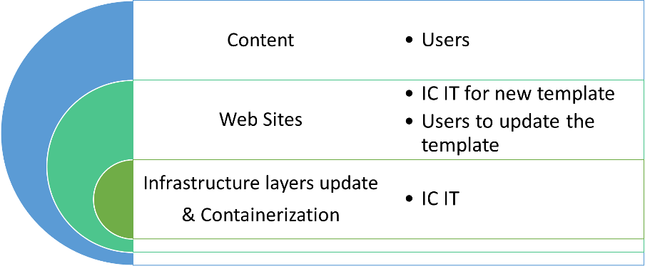
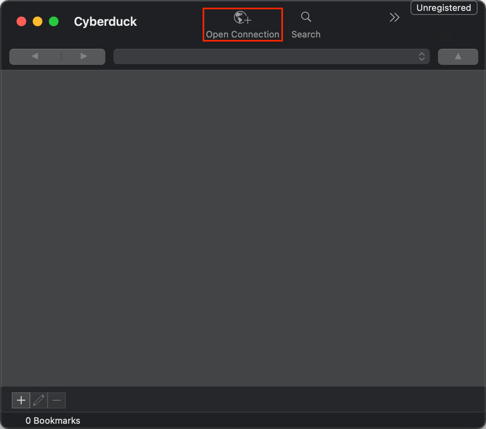
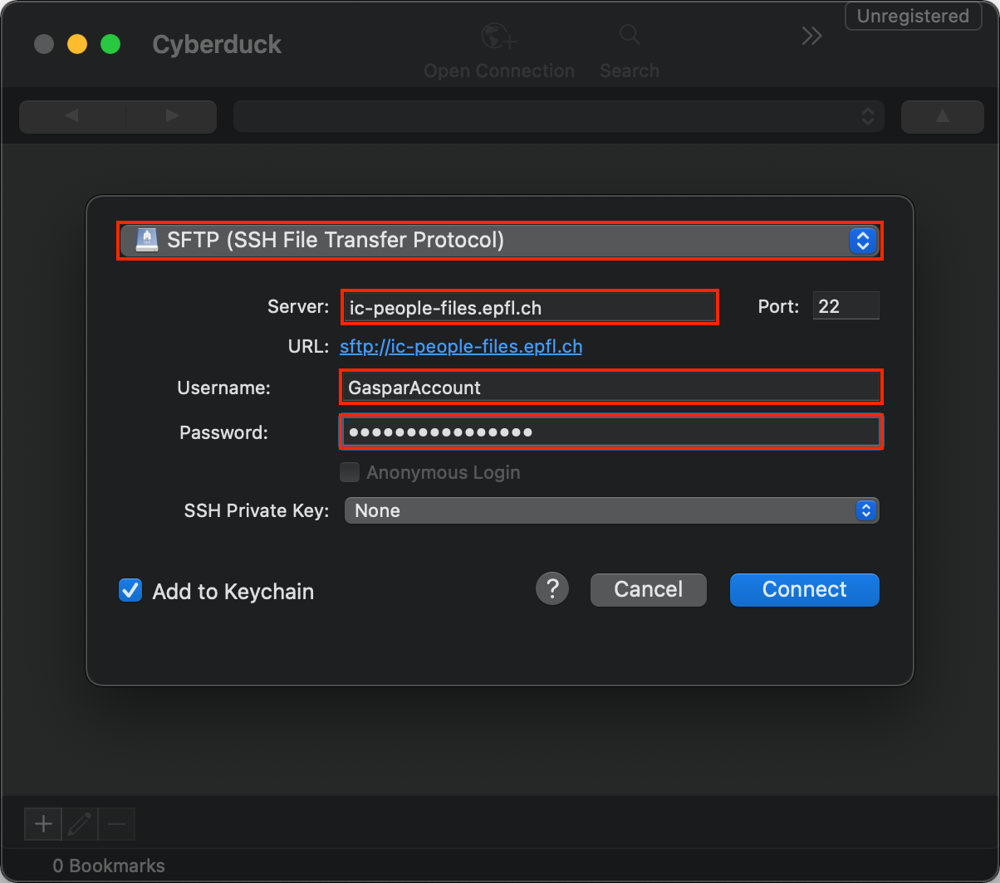

# EPFL x IC-People 

## Guidelines

### Version 1.0
17.02.2022 (latest update)


## 1. IC-People
IC-People is a local hosting service with an EPFL domain name provided by the School of Computer and Communication Sciences (IC) for:
1) All PhD and MA students to showcase their research 
2) and made available to professors for their personal research pages. 

## 2. Objective
This professional service is an EPFL resource provided to IC students and professors to help present themselves, and increase their visibility and that of the School. This is done in the context of their professional mission or studies, and allows the users to present themselves with the EPFL name. 

As a reminder, there are two centralized resources i) People Directory and ii) Laboratory websites that are part of the professional requirements and presentation of EPFL staff, students, with up to date research and career information. 

In particular, the People Directory is an important source of data that should be regularly updated by professors, as this information is used for the official AAR (academic activity report) that the [VPA-EM](http://VPA-EM) provides to the ETH Board. 

## 3. Summary of the service
* EPFL domain name: ic-people.epfl.ch/~username/ 
* Personal page/business card to showcase research
* Each user has a quota of 1Gb
* No retrieval of information from EPFL databases
* Content is added manually by the user
* Freedom to choose between the available templates: 1) ready-to-use modular based, 2) minimalist header + footer, or 3) blank page. 
* Files on GitHub: Readme guidelines, CSS/JS/html that can be customized and adapted as needed
* Minimal support for self-starter
* Data compliance and deletion of content according to LEX and EPFL policy.

## 4. Templates
To help build your webpage, there are two main templates available:

### 4.1. Modular Templates

We’ve created easy and ready-to-use modular based templates with CSS/JS/html blocks that can be customized and adapted to your content.  

#### 4.1.1. Base with large photo 
https://epfl-ic.github.io/
#### 4.1.2. Base with medium sized photo 
https://epfl-ic.github.io/examples/version-image-medium.html
#### 4.1.3. Base with small photo 
https://epfl-ic.github.io/examples/version-image-small.html
#### 4.1.4. Example Master student with medium sized photo 
https://epfl-ic.github.io/examples/version-layout-master.html
### 4.2. Minimalist Template
If you do not wish to use any of the modular blocks, we’ve created a minimalist
template with a branded header and footer. You can fill in your content freely.

#### 4.2.1. Base with header & footer 
https://epfl-ic.github.io/examples/version-minimal.html

#### 4.3. It’s possible to request an empty page for you to import your content. We do however strongly encourage the use of one of the templates at your disposal which incorporates EPFL visual identity elements. 

## 5. Rules for publication 
Use of this hosting service is permitted to the extent that it is consistent with the EPFL and applicable laws.

Users are prohibited from using the website in a manner that:
* is contrary to EPFL’s mission;
* is contrary to the above-mentioned objectives;
* violates applicable laws;
* is harmful to EPFL’s interests; or
* compromises the security of EPFL’s IT systems.

The IC Head of Communication can remove, without prior notification or justification: 
* Any content that is violent, insulting, vulgar, obscene, degrading or inciting to hatred. 
* Any content that would damage the rights or image of EPFL, its community and/or a third party.
* Remove content that does not respect privacy and includes, for example, personal data without the consent of the person concerned (telephone number of a person, address, photo,...);

The Head of Communication of the IC School can also prevent a User whose content/page has been removed, to publish further content and/or use the service.

If you notice some content that should be or should not have been removed, please contact us at support-icit@epfl.ch.

## 6. Storage
In case of departure from EPFL, in accordance with LEX 6.1.4, there will be a grace period based on the EPFL Leave Process. After the grace period, the webpage and data is retired, removed and deleted.
1. MA students after one months
2. PhD students after six months
3. and Professors on the last day of their accreditation.
Find out more:
https://www.epfl.ch/campus/services/en/it-services/mail-lists-and-calendar/mail/persons-arrival-and-departure/

## 7. Responsibility
The hosting service and webpage is provided as a courtesy of the EPFL. It is provided on an “as is” basis with no warranties, and in particular no warranty of accuracy, availability or correctness.

The user is solely responsible for the published content and will indemnify and hold harmless EPFL and its employees from any and all claims and damages.

## 8. Confidentiality and sharing data 
We strongly recommend the service user to share only the data that he/she wants to be public. The nature of the data must be in line with the service. As it is a web site, implicitly the data will be public. The data will be removed at the departure of the person (see above).

## 9. Accountability stack for the service
The following describes the accountability for the service and who manages each layer: 



(Nb: The reference used for this service is here: Request a website ‒ Website ‐ EPFL although all options are of course not available, please ask IC IT for details and current capability).


## 10. Getting started
All PhD, MA students and professors are part of a group authorized to use this service via their EPFL Gaspar authentication

### 10.1. Setup
For hosting the files, we use an SFTP server. You have to be connected to EPFL VPN (https://www.epfl.ch/campus/services/ressources-informatiques/network-services-reseau/acces-intranet-a-distance/clients-vpn-disponibles/).

### 10.2. Access infos :
* Host: ic-people-files.epfl.ch
* Username: Gaspar Username
* Password: Gaspar Password
* Index folder: public_html

If you don't know how to acess an SFTP server, here is two tutorials.

### 10.3. Windows/MacOS
1. Go to https://cyberduck.io/download/
2. Download and install it
3. Go on the application and click on the button circled in red on the image.



4. At the top select SFTP
5. In the server field enter: ic-people-files.epfl.ch
6. For the field username and password: use your GasparAccount.



7. Next, click on connect
8. Click on allow
9. Double click on public_html
10. Here you can place your files
11. Your site will be accessible on the following URL: https://ic-people.epfl.ch/~username/

### 10.4. Linux
1. Connect to the EPFL VPN
2. Use ``` sftp username@ic-people-files.epfl.ch ```
3. Enter your Gaspar password
4. Get into public_html dir with ``` cd public_html ```
5. Use ``` put myFile ``` to put your files in your directory
6. Your site will be accessible on the following URL: https://ic-people.epfl.ch/~username/
7. That's it, you're all set!

## 11. Administrators
The main administrators of the IC-People platform with full access to all content:
* Set-up & IT support: support-icit@epfl.ch
* Templates and guidelines: Deirdre.Rochat@epfl.ch.
